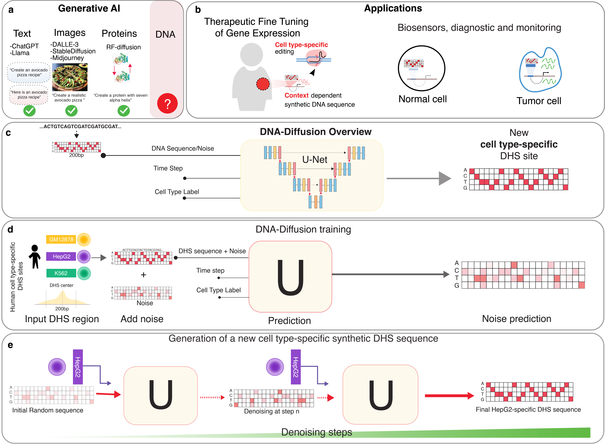

# DNA Diffusion

 </img>

<p align="center">
    <em>Generative modeling of regulatory DNA sequences with diffusion probabilistic models.</em>
</p>

[](https://github.com/pinellolab/DNA-Diffusion/actions)
[](https://codecov.io/gh/pinellolab/DNA-Diffusion)
[](https://badge.fury.io/py/dnadiffusion)

<!-- ALL-CONTRIBUTORS-BADGE:START - Do not remove or modify this section -->
[](#contributors-)
<!-- ALL-CONTRIBUTORS-BADGE:END -->

[](https://huggingface.co/ssenan/DNA-Diffusion)

---

**Documentation**: <a href="https://pinellolab.github.io/DNA-Diffusion" target="_blank">https://pinellolab.github.io/DNA-Diffusion</a>

**Source Code**: <a href="https://github.com/pinellolab/DNA-Diffusion" target="_blank">https://github.com/pinellolab/DNA-Diffusion</a>

---

## Contents
- [Introduction](#introduction)
- [Installation](#installation)
- [Usage](#usage)
  - [Data](#data)
  - [Training](#training)
  - [Model Checkpoint](#model-checkpoint)
  - [Sequence Generation](#sequence-generation)
- [Examples](#examples)
  - [Training Notebook](#training-notebook)
  - [Sequence Generation Notebook](#sequence-generation-notebook)

## Introduction

DNA-Diffusion is diffusion-based model for generation of 200bp cell type-specific synthetic regulatory elements.

<div align="center">

</div>


## Installation
Our preferred package / project manager is [uv](https://github.com/astral-sh/uv). Please follow their recommended instructions for installation.

To clone the repository and install the necessary packages, run:

```bash
git clone https://github.com/pinellolab/DNA-Diffusion.git
cd DNA-Diffusion
uv sync
```

This will create a virtual environment in `.venv` and install all dependencies listed in the `uv.lock` file. This is compatible with both CPU and GPU, but preferred operating system is Linux with a recent GPU (e.g. A100 GPU). For detailed versions of the dependencies, please refer to the `uv.lock` file.

## Recreating data curation, training and sequence generation processes

### Data
We provide a small subset of the DHS Index dataset that was used for  training at `data/K562_hESCT0_HepG2_GM12878_12k_sequences_per_group.txt`.

If you would like to recreate the dataset, you can call:

```bash
uv run data/master_dataset_and_filter.py
```
which will download all the necessary data and create a file `data/master_dataset.ftr` containing the full ~3.59 million dataset and a file `data/filtered_dataset.txt` containing the same subset of sequences as above. A rendered version of this code is provided at `notebooks/marimo_master_dataset_and_filter.ipynb`.


To run data curation process as a notebook, a marimo notebook file can be found at `notebooks/marimo_master_dataset_and_filter.py`.

This notebook can be opened/run with the following command:
```bash
uvx marimo edit notebooks/marimo_master_dataset_and_filter.py
```

All of the data processing files make use of uv to manage dependencies and so all libraries are installed when you run the above commands. See [uv documentation](https://docs.astral.sh/uv/guides/scripts/) for more information on how to run uv scripts and [marimo documentation](https://docs.marimo.io/) for more information on how to run marimo notebooks.


### Training
To train the DNA-Diffusion model, we provide a basic config file for training the diffusion model on the same subset of chromatin accessible regions described in the data section above.

To train the model call:

```bash
uv run train.py
```

We also provide a base config for debugging that will use a single sequence for training. You can override the default training script to use this debugging config by calling:

```bash
uv run train.py -cn train_debug
```

### Model Checkpoint
We have uploaded the model checkpoint to [HuggingFace](https://huggingface.co/ssenan/DNA-Diffusion).  Below we provide an example script that handles downloading the model checkpoint and loading it for sequence generation.

### Sequence Generation
We provide a basic config file for generating sequences using the diffusion model resulting in 1000 sequences made per cell type.  To generate sequences using the trained model, you can run the following command:

```bash
uv run sample_hf.py
```

The default setup for sampling will generate 1000 sequences per cell type. You can override the default sampling script to generate one sequence per cell type with the following cli flags:

```bash
uv run sample_hf.py sampling.number_of_samples=1 sampling.sample_batch_size=1
```

Base generation utilizes a guidance scale 1.0, however this can be tuned within the sample.py with the `guidance_scale` parameter. This can be overridden in the command line as follows (generating using guidance scale 7.0):

```bash
uv run sample_hf.py sampling.guidance_scale=7.0 sampling.number_of_samples=1 sampling.sample_batch_size=1
```

If you would prefer to download the model checkpoint from Hugging Face and use it directly, you can run the following command to download the model and save it in the checkpoint directory:
```bash
wget https://huggingface.co/ssenan/DNA-Diffusion/resolve/main/model.safetensors -O checkpoints/model.safetensors
```

Then you can run the sampling script with the following command:
```
uv run sample.py
```

## Examples

### Training Notebook

We provide an example colab notebook for training and sampling with the diffusion model. This notebook runs the previous commands for training and sampling.

[](https://colab.research.google.com/drive/160tjHJFtnf-Sj7uyLDBAQjFwUywqOT96?usp=sharing)

along with a copy of the notebook at `notebooks/training_and_sequence_generation.ipynb`

### Sequence Generation Notebook
We also provide a colab notebook for generating sequences with the diffusion model using the trained model hosted on Hugging Face. This notebook runs the previous commands for sampling and shows some example outputs.

[](https://colab.research.google.com/drive/1fLjWUkEFka8xyu5Q5uoklnJW7AZ37Tgn?usp=sharing)

along with a copy of the notebook at `notebooks/sequence_generation.ipynb`

Both examples were run on Google Colab using a T4 GPU.

## Using your own data

DNA-Diffusion is designed to be flexible and can be adapted to your own data. To use your own data, you will need to follow these steps:

* Prepare your data in the same format as the DHS Index dataset. The data should be a tab separated text file with the following columns:
  * `chr`: the chromosome of the regulatory element (e.g. chr1, chr2, etc.)
  * `sequence`: the DNA sequence of the regulatory element
  * `TAG`: the cell type of the regulatory element (e.g. K562, hESCT0, HepG2, GM12878, etc.)

* It's expected that your sequences are 200bp long, however the model can be adapted to work with different sequence lengths by the dataloading code at `src/dnadiffusion/data/dataloader.py`. You can change the `sequence_length` parameter in the function `load_data` to the desired length, but keep in mind that the original model is trained on 200bp sequences and so the results may not be as good if you use a different length.
* The model is designed to work with discrete class labels for the cell types, so you will need to ensure that your data is in the same format. If you have continuous labels, you can binarize them into discrete classes using a threshold or some other method. This value is contained within the `TAG` column of the dataset.

## Contributors ✨

Thanks goes to these wonderful people ([emoji key](https://allcontributors.org/docs/en/emoji-key)):

<!-- ALL-CONTRIBUTORS-LIST:START - Do not remove or modify this section -->
<!-- prettier-ignore-start -->
<!-- markdownlint-disable -->
<table>
  <tbody>
    <tr>
      <td align="center" valign="top" width="14.28%"><a href="https://github.com/LucasSilvaFerreira"><br /><sub><b>Lucas Ferreira da Silva</b></sub></a><br /><a href="#ideas-LucasSilvaFerreira" title="Ideas, Planning, & Feedback">🤔</a> <a href="https://github.com/pinellolab/DNA-Diffusion/commits?author=LucasSilvaFerreira" title="Code">💻</a></td>
      <td align="center" valign="top" width="14.28%"><a href="http://pinellolab.org"><br /><sub><b>Luca Pinello</b></sub></a><br /><a href="#ideas-lucapinello" title="Ideas, Planning, & Feedback">🤔</a></td>
      <td align="center" valign="top" width="14.28%"><a href="https://github.com/ssenan"><br /><sub><b>Simon</b></sub></a><br /><a href="#ideas-ssenan" title="Ideas, Planning, & Feedback">🤔</a> <a href="https://github.com/pinellolab/DNA-Diffusion/commits?author=ssenan" title="Code">💻</a></td>
    </tr>
  </tbody>
</table>

<!-- markdownlint-restore -->
<!-- prettier-ignore-end -->

<!-- ALL-CONTRIBUTORS-LIST:END -->

<a href="https://github.com/pinellolab/DNA-Diffusion/graphs/contributors">
  
</a>

This project follows the [all-contributors](https://github.com/all-contributors/all-contributors) specification. Contributions of any kind welcome!
